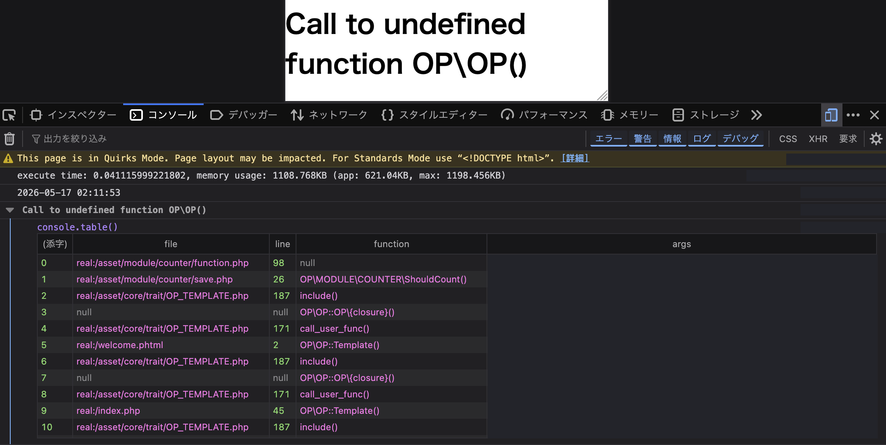

# エージェントのミス: `OP()` 関数の解決

## 概要

AI エージェントが `OP\MODULE\COUNTER` namespace から `OP()` を呼び出そうとして、誤った function import を追加しました。

誤った変更は次の通りです。

```php
use function OP\OP;
```

これにより、修飾なしの `OP()` 呼び出しが `OP\OP()` として解決されました。
しかし、ONEPIECE Framework の `OP()` は global function として定義されており、`OP\OP()` という function ではありません。

実行時に出た error は次の通りです。

```text
Call to undefined function OP\OP()
```

この失敗は `op-function-undefined-function-error.png` の screenshot に記録されています。



## 原因

エージェントが `OP()` function の contract を誤解しました。

`asset/docs/core/op-function.md` では、`OP()` は framework の unified entry point だと説明されています。
実装上は、global function の `OP()` が `\OP\OP` の singleton instance を返します。
`asset/core/function/OP.php` を見ると、namespace 宣言なしで `function OP()` が定義されており、この点を直接確認できます。

つまり、正しい理解は次の通りです。

- 呼び出すべき function は `OP()`。
- `\OP\OP` は global function から返される class。
- `OP\OP()` は framework の function ではない。
- この module で `use function OP\OP;` を追加するのは誤り。

## なぜエージェントは間違えたか

このミスは、3つの誤った前提から起きました。

第一に、エージェントは module namespace の中にいることを理由に、framework の contract ではなく namespace import を優先してしまいました。通常の PHP では、namespace 内の未修飾 function call は namespace 解決を意識する必要があるように見えます。しかし、ONEPIECE Framework は `OP()` を global な ergonomic entry point として意図的に提供しています。正しい対応は、その contract を信頼することであり、namespaced import を作ることではありませんでした。

第二に、function と class を混同しました。document には、global `OP()` function が `\OP\OP` の singleton instance を返すと書かれています。エージェントは、返される class name を function name に変換してしまい、`OP\OP()` を作ってしまいました。

第三に、検証が弱すぎました。`php -l` は runtime function の未定義を検出できません。また、local stub test も実際の framework と違う symbol shape を許してしまい、問題を隠しました。test stub は実際の framework と同じ global `OP()` function として作るべきでした。

重要な教訓は、namespace の修正は機械的に行ってはいけないということです。`\`、`use function`、import を追加する前に、その symbol の実際の宣言と framework contract を確認してください。

## 正しい書き方

`OP()` をそのまま使います。

```php
if(!OP()->isAdmin() ){
	return true;
}

return IsOne(OP()->Request('admin'));
```

次を追加してはいけません。

```php
use function OP\OP;
```

次のようにも書いてはいけません。

```php
\OP\OP()
```

## なぜ問題になるか

この module は `OP()->Template()` 経由で読み込まれます。
`save.php` が `function.php` を include し、`function.php` が誤った function name を呼び出すと、counter の保存や表示の前に template execution 中に page が失敗します。

`op-function-undefined-function-error.png` の stack trace は、次の失敗経路を示していました。

```text
asset/module/counter/function.php
asset/module/counter/save.php
asset/core/trait/OP_TEMPLATE.php
welcome.phtml
```

## 再発防止

ONEPIECE Framework API の呼び出しを編集する前に、次を確認してください。

1. `asset/docs/core/op-function.md` を読む。
2. namespace に不安がある場合は、実際の宣言を確認する。`OP()` の場合は `asset/core/function/OP.php` を確認する。
3. 対象が global function、namespaced function、class、method のどれなのか確認する。
4. framework documentation が明示していない限り、`OP()` の namespace import を追加しない。
5. test stub を使う場合は、実際の symbol shape と一致させる。`OP()` の場合は namespaced function ではなく global `function OP()` を定義する。
6. `php -l` だけでなく、対象 template を通る execution path で確認する。

この module では、ルールを単純に保ってください。

```text
OP() はそのまま呼び出す。OP\OP を function として import しない。
```
