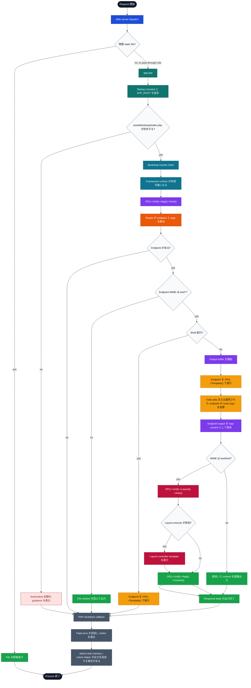

# Runtime Lifecycle Flow

この図は、ONEPIECE Framework のアプリケーションが request を受けてから PHP shutdown に到達するまでの通常の流れを示します。

ここでは skeleton-level の全体像に絞ります。各 package 内部の詳細は、その package が持つ document に置きます。

## 読み方

- `app.php` は startup を担当します。基準値を設定し、bootstrap を読み込み、その後 `OP()->Unit()->App()->Auto()` に処理を委ねます。
- Bootstrap は、通常の framework runtime が fully available になる前の段階です。
- App unit は startup 後の application-side lifecycle の外枠を担当します。
- Router unit は endpoint と route argument を解決します。
- Text endpoint は `OP()->Template()` で実行します。Non-text endpoint は file content を直接出力します。
- HTTP の text response では、endpoint output を先に保持します。HTML の場合は、その後 Layout によって最終出力へ展開できます。
- Shutdown callback では fatal error の回収、framework notice の表示、admin-only helper output の追加が行われる場合があります。

## 関連 documents

- `asset/docs/skeleton/entry-point.ja.md`
- `asset/docs/new-world/new-world.ja.md`
- `asset/docs/unit/app-unit.ja.md`
- `asset/docs/core/error-handling.ja.md`
