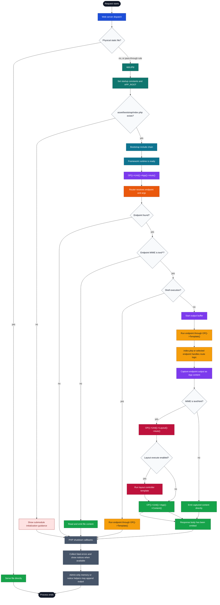

# Runtime Lifecycle Flow

This chart shows the normal ONEPIECE Framework application lifecycle from request entry to PHP shutdown.

It focuses on the skeleton-level flow. Package-internal details are intentionally kept in the responsible package documents.

## Reading Guide

- `app.php` owns startup. It sets baseline values, loads bootstrap, and then delegates to `OP()->Unit()->App()->Auto()`.
- Bootstrap is still before the normal framework runtime is fully available.
- The App unit owns the outer application-side lifecycle after startup.
- The Router unit resolves the endpoint and route arguments.
- Text endpoints are executed through `OP()->Template()`. Non-text endpoints are emitted directly.
- For HTTP text responses, endpoint output is captured first. HTML output can then be expanded through Layout before final emission.
- Shutdown callbacks can still collect fatal errors, show framework notices, or append admin-only helper output.

## Related Documents

- `asset/docs/skeleton/entry-point.md`
- `asset/docs/new-world/new-world.md`
- `asset/docs/unit/app-unit.md`
- `asset/docs/core/error-handling.md`
